```mermaid
graph TB
    subgraph "🌐 Frontend Layer"
        U[👤 User] --> FE[⚛️ React Frontend<br/>File Upload Interface]
        FE --> API[📡 API Request<br/>File + Metadata]
    end

    subgraph "🔧 Backend Processing Layer"
        API --> B[🔄 File Type Router<br/>Flask API]

        subgraph "📥 Input Processing"
            B --> C[📄 Document Processor]
            B --> D[🖼️ Image Processor]
            B --> E[🎵 Audio Processor]
            B --> F[🎬 Video Processor]

            C --> C1[Unstructured<br/>Partition]
            D --> D1[PyTesseract<br/>OCR]
            E --> E1[SpeechRecognition<br/>Library]
            F --> F1[Frame Extraction<br/>+ Audio Separation]
        end

        subgraph "🤖 AI Analysis"
            C1 --> G[🔄 Content Aggregator]
            D1 --> G
            E1 --> G
            F1 --> G

            G --> H[💬 Prompt Engine<br/>LangChain Templates]
            H --> I[🧠 LLM Gateway<br/>Google Gemini API]
        end
    end

    subgraph "📤 Response Layer"
        I --> J[📈 Analysis Results<br/>JSON Response]
        J --> FE2[⚛️ Frontend Display<br/>Markdown Rendering]
        FE2 --> U2[👤 User Views<br/>Analysis & Export]
    end

    %% Styling with better contrast
    classDef frontend fill:#e3f2fd,stroke:#1565c0,stroke-width:2px,color:#000000
    classDef backend fill:#e8f5e8,stroke:#2e7d32,stroke-width:2px,color:#000000
    classDef input fill:#fff3e0,stroke:#ef6c00,stroke-width:2px,color:#000000
    classDef ai fill:#fce4ec,stroke:#c2185b,stroke-width:2px,color:#000000
    classDef response fill:#f3e5f5,stroke:#7b1fa2,stroke-width:2px,color:#000000

    class U,FE,API,FE2,U2 frontend
    class B,C,D,E,F,C1,D1,E1,F1 backend
    class G,H input
    class I ai
    class J response
```

<div align="center">


<h1 align="center">PolySensor</h1>

### **AI-Powered Multi-Modal Content Analyzer**

</div>

<br>

A full-stack web application that leverages advanced AI to analyze and extract insights from virtually any type of media content. Built with cutting-edge technologies including React, Flask, LangChain, and Google's Gemini model, PolySensor transforms unstructured data into actionable intelligence through an intuitive web interface.

## 🌟 What Makes PolySensor Unique?

### 🧠 **Intelligent Content Understanding**
- **Multi-Modal Analysis**: Seamlessly processes documents, images, audio, and video files
- **Advanced RAG Architecture**: Utilizes Retrieval-Augmented Generation for superior contextual understanding
- **Universal Text Extraction**: Capable of extracting and analyzing textual information from almost any format

### 🔄 **Powered by State-of-the-Art AI**
- **Google Gemini Integration**: Harnesses the power of one of the most advanced LLMs available
- **LangChain Orchestration**: Professional-grade AI workflow management
- **Smart Context Awareness**: Understands content relationships and nuances

### 📊 **Comprehensive Content Coverage**
From research papers to multimedia presentations, PolySensor delivers deep analytical insights across:
- **Academic & Technical Documents**
- **Business Reports & Presentations** 
- **Multimedia Content & Recordings**
- **Visual Data & Infographics**

---



---

## 🌟 Features

### Frontend Features
- **Intuitive Drag-and-Drop Interface**: Seamless file upload with real-time validation and preview
- **Responsive Design**: Modern React-based UI that works across devices and screen sizes
- **Real-Time Processing Feedback**: Loading indicators and error handling for smooth user experience
- **Rich Markdown Rendering**: Beautiful display of AI analysis results using markdown-to-jsx
- **One-Click PDF Export**: Export analysis results to PDF using html2canvas and jsPDF for easy sharing

### Backend Features
- **Flask API Server**: Single RESTful endpoint (/analyze0) for file uploads with CORS enabled for frontend communication
- **File Type Detection**: Extension-based routing for documents, images, audio, and video files
- **Document Processing**: Uses Unstructured library to extract and convert content from 40+ document formats into JSON for AI analysis
- **Media Validation**: Length limits (1 minute for audio, 30 seconds for video) with premium upgrade messaging for longer content
- **AI Integration**: Google Gemini 2.5 Pro model with LangChain orchestration using specialized prompts for each media type
- **Temporary Storage**: Secure file handling with automatic cleanup of uploaded files and temp directories
- **Error Handling**: JSON responses for file validation errors, processing failures, and unsupported formats
- **Content Analysis**: Structured analysis output in table format for all media types with pattern detection and insights

## 📸 Screenshots

### Frontend Interface
<div align="center">
  
  <p><em>Main application interface with drag-and-drop file upload</em></p>
</div>

### Analysis Results
<div align="center">
  <table>
    <tr>
      <td align="center">
        
        <p><em>Raw file [Presentation File] as input</em></p>
      </td>
      <td align="center">
        
        <p><em>PolySensor analysis results, which is exportable to pdf format.</em></p>
      </td>
    </tr>
  </table>
</div>

## 📋 Supported File Formats

<h2 align="center"><i>Image Files</i></h2>

<div align="center">

| Extension(s) | Description |
|--------------|-------------|
| `.jpg`, `.jpeg` | JPEG images |
| `.png` | Portable Network Graphics |
| `.gif` | Graphics Interchange Format |
| `.webp` | WebP image |
| `.heic` | High Efficiency Image Format |
| `.tif`, `.tiff` | Tagged Image File Format |
| `.bmp` | Bitmap Image File |

</div>

<h2 align="center"><i>Audio Files</i></h2>

<div align="center">

| Extension(s) | Description |
|--------------|-------------|
| `.mp3` | MPEG Audio Layer III |
| `.wav` | Waveform Audio File Format |
| `.flac` | Free Lossless Audio Codec |
| `.aiff` | Audio Interchange File Format |

</div>

<h2 align="center"><i>Video Files</i></h2>

<div align="center">

| Extension(s) | Description |
|--------------|-------------|
| `.mp4` | MPEG-4 Part 14 Video |
| `.mkv` | Matroska Video File |

</div>

---

<h2 align="center"><i>Documents and Text Files</i></h2>

<div align="center">

| Extension(s) | Description |
|--------------|-------------|
| `.pdf` | Portable Document Format |
| `.docx` | Microsoft Word Open XML Document |
| `.doc` | Microsoft Word Document (older format) |
| `.txt` | Plain Text File |
| `.odt` | OpenDocument Text File |
| `.rtf` | Rich Text Format |
| `.md` | Markdown Documentation |
| `.epub` | Electronic Publication |
| `.hwp` | Hangul Word Processor File |
| `.abw`, `.zabw` | AbiWord Document |
| `.org` | Lotus Organizer Data File or Data Analysis File |
| `.rst` | reStructuredText File |

</div>

<h2 align="center"><i>Spreadsheets</i></h2>

<div align="center">

| Extension(s) | Description |
|--------------|-------------|
| `.xlsx` | Microsoft Excel Open XML Spreadsheet |
| `.xls` | Microsoft Excel Spreadsheet (older format) |
| `.csv` | Comma-Separated Values File |
| `.tsv` | Tab-Separated Values File |
| `.fods` | OpenDocument Flat XML Spreadsheet |
| `.dif` | Data Interchange Format File |
| `.dbf` | dBase Database File |
| `.et` | E-Text Spreadsheet |

</div>

<h2 align="center"><i>Presentations</i></h2>

<div align="center">

| Extension(s) | Description |
|--------------|-------------|
| `.pptx` | Microsoft PowerPoint Open XML Presentation |
| `.ppt` | Microsoft PowerPoint Presentation (older format) |
| `.pptm` | Microsoft PowerPoint Macro-Enabled Presentation |
| `.pot` | Microsoft PowerPoint Template |

</div>

<h2 align="center"><i>Email Files</i></h2>

<div align="center">

| Extension(s) | Description |
|--------------|-------------|
| `.msg` | Microsoft Outlook Message |
| `.eml` | Electronic Mail File |
| `.p7s` | PKCS #7 Signature File Format |

</div>

<h2 align="center"><i>Other File Types</i></h2>

<div align="center">

| Extension(s) | Description |
|--------------|-------------|
| `.xml` | Extensible Markup Language File |
| `.html`, `.htm` | Hypertext Markup Language File |
| `.md` | Markdown Documentation |
| `.cwk` | AppleWorks Document |
| `.mcw` | Microchip MPLAB Workspace |
| `.prn` | Print to File |
| `.eth` | Ethnograph Data File |
| `.pbd` | PowerBuilder Document |
| `.sdp` | Session Description Protocol File |
| `.mw` | MathWorks MATLAB Workspace File |
| `.sxg` | Signed Exchange File |

</div>

---

## 🚀 Quick Start

### Prerequisites

- Python 3.11 _(Recommended for Unstructured)_ or can use higher version 3.11+
- Node.js 16+ and npm
- Google Gemini API key
- Tesseract OCR (for image/text extraction)

### Installation

1. **Clone the repository**
```bash
git clone https://github.com/adityasinghcoding/PolySensor.git
cd PolySensor
```

2. **Backend Setup**
```bash
# Install Python dependencies
pip install -r requirements.txt

# Install Tesseract OCR
# Windows: Download from https://github.com/UB-Mannheim/tesseract/wiki
# Mac: brew install tesseract
# Linux: sudo apt-get install tesseract-ocr

# Set up environment variables
cp .env.example .env
# Edit .env and add your Google API key
GOOGLE_API_KEY=your_api_key_here
```

3. **Frontend Setup**
```bash
# Navigate to frontend directory
cd frontend

# Install Node.js dependencies
npm install

# Return to root directory
cd ..
```

### Usage

1. **Start the Backend Server**
```bash
python main.py
```
The Flask server will start on `http://localhost:5000`

2. **Start the Frontend (in a new terminal)**
```bash
cd frontend
npm run dev
```
The React app will be available at `http://localhost:5173`

3. **Access the Application**
Open your browser and navigate to `http://localhost:5173` to use the web interface. Upload files through the drag-and-drop interface and receive AI-powered analysis results.

## 🐳 Docker Setup (Recommended)

For easier development and deployment, PolySensor supports Docker. This ensures consistent environments and handles system dependencies automatically.

### Prerequisites
- Docker and Docker Compose installed on your system
- Google Gemini API key

### Quick Start with Docker

1. **Clone the repository**
```bash
git clone https://github.com/adityasinghcoding/PolySensor.git
cd PolySensor
```

2. **Set up environment variables**
```bash
cp .env.example .env
# Edit .env and add your Google API key
GOOGLE_API_KEY=your_api_key_here
```

3. **Run the application**
```bash
docker-compose up --build
```

4. **Access the Application**
- Frontend: `http://localhost:5173`
- Backend API: `http://localhost:5000`

### Docker Commands
- **Start services**: `docker-compose up`
- **Build and start**: `docker-compose up --build`
- **Stop services**: `docker-compose down`
- **View logs**: `docker-compose logs -f [service_name]`
- **Rebuild specific service**: `docker-compose up --build [service_name]`

### Production Deployment
- **Backend**: The `render.yaml` is configured for Docker deployment on Render
- **Frontend**: Deploy to Vercel as usual (static hosting)

## 🏗️ Project Structure

```
PolySensor/
├── main.py                    # Flask backend entry point
├── data_handling.py           # Content extraction and validation utilities
├── prompts.py                 # AI prompt templates for different content types
├── requirements.txt           # Python dependencies
├── .env                       # Environment variables (API keys)
├── .gitignore                 # Git ignore rules
├── README.md                  # Project README
├── DOCS/                      # Documentation
├── frontend/                  # React frontend application
│   ├── public/
│   │   ├── index.html         # Main HTML template
│   │   └── favicon.ico
│   ├── src/
│   │   ├── components/           # Reusable React components
│   │   │   ├── AnalysisResults/  # Displays analysis output with markdown support
│   │   │   ├── FileUploader/     # Drag-and-drop file upload interface
│   │   │   └── Loading/          # Loading spinner component
│   │   ├── pages/
│   │   │   └── AnalyzePage.jsx   # Main analysis page
│   │   ├── utils/
│   │   │   └── apiService.js     # API communication utilities
│   │   ├── App.jsx               # Main React application component
│   │   ├── App.css               # Global styles
│   │   ├── main.jsx              # React application entry point
│   │   └── index.css             # Base styles
│   ├── package.json              # Node.js dependencies and scripts
│   └── vite.config.js            # Vite build configuration
├── assets/                       # Project assets
└── utilities/                    # Additional tools

PolySensor/
├── main.py                 # Flask backend server
├── data_handling.py        # Media processing functions
├── prompts.py             # AI prompt templates
├── requirements.txt       # Python dependencies
├── .env                   # Environment variables (create this)
```

### Core Modules

**Backend:**
- `main.py`: Flask API server with CORS support, handles file uploads and AI processing
- `data_handling.py`: Content extraction functions for documents, images, audio, and video
- `prompts.py`: Specialized prompts for different media types optimized for Gemini AI

**Frontend:**
- `App.jsx`: Main application router and state management
- `AnalyzePage.jsx`: Core analysis interface with file upload and results display
- `FileUploader.jsx`: Drag-and-drop file upload component with validation
- `AnalysisResults.jsx`: Markdown rendering component with PDF export functionality
- `apiService.js`: Axios-based API client for backend communication

## 🔧 Configuration
### API Keys
Get your Google Gemini API key from [Google AI Studio](https://aistudio.google.com/app/apikey) and add it to your .env file:
```
GOOGLE_API_KEY=your_actual_api_key_here
```

### Customizing Analysis
You can modify the analysis prompts in `prompts.py` to tailor the output to your specific needs:
```
# Example custom prompt
CUSTOM_ANALYSIS = '''
Analyze this content and focus on technical details:

Content: {content_data} // Place holder which contains the function output

Please provide:
1. Technical specifications
2. Implementation details
3. Potential improvements
'''
```

## 💡 Examples
### Document Analysis
```
# Input: research_paper.pdf
# Output: Summary of key findings, methodology, and conclusions
```

### Image Analysis
```
# Input: diagram.png  
# Output: Extracted text + analysis of visual content and structure
```

### Video Analysis
```
# Input: presentation.mp4
# Output: Combined analysis of slide content and spoken presentation
```
## 🛠️ Development
### Adding New File Types
1. Add file extension detection in `main.py`:
```
if file_path.lower().endswith(('.new_extension')):
    new_data = new_extraction_function(file_path)
```

2. Create extraction function in `text_extractor.py`:
```
def new_extraction_function(file_path):
    # Implement extraction logic
    return extracted_content
```

3. Add prompt template in `prompts.py`:
```
NEW_TYPE = '''
Your analysis prompt for new file type...
'''
```

### Running Tests
```
# Add tests to the repository and run with:
python -m pytest tests/
```
## 📊 Output Examples
The AI provides structured analysis including:

- **Key Points**: Main takeaways from the content
- **Summary**: Concise overview of the material
- **Actionable Insights**: Practical recommendations
- **Ambiguity Detection**: Identification of unclear sections

---
## 🤝 Contributing
We welcome contributions! Please see our Contributing Guidelines for details.

1. Fork the repository
2. Create a feature branch (`git checkout -b feature/amazing-feature`)
3. Commit your changes (`git commit -m 'Add amazing feature'`)
4. Push to the branch (`git push origin feature/amazing-feature`)
5. Open a Pull Request

## 🐛 Troubleshooting
### Common Issues
**"File does not exist" error**
- Check file path spelling
- Use absolute paths if needed

**OCR not working**
- Verify Tesseract installation
- Check image quality and resolution

**API key errors**
- Ensure `.env` file is in the project root
- Verify the API key has sufficient permissions

**Audio/video processing slow**
- Large files may take time to process
- Consider shorter intervals for video analysis

### Getting Help
- Check existing [Issues](https://github.com/adityasinghcoding/PolySensor/issues) for similar problems
- Create a new issue with detailed error messages and file examples

---

## 👥 Credits & Acknowledgments

### 🧑‍💻 Project Creator
**Aditya Singh**  
- Artificial Intelligence Engineer  
- Project Lead & Full-Stack Developer
- AI/ML Integration & Architecture Design  
- Multi-modal Content Processing Specialist  

### 🛠️ Technologies & Libraries
This project stands on the shoulders of these amazing open-source technologies:

| Technology | Purpose | Credit |
|------------|---------|--------|
| **React** | Frontend Framework | [Meta](https://reactjs.org/) |
| **Vite** | Build Tool & Dev Server | [Vite](https://vitejs.dev/) |
| **Flask** | Backend Web Framework | [Pallets](https://flask.palletsprojects.com/) |
| **Google Gemini** | AI Language Model | [Google AI](https://deepmind.google/technologies/gemini/) |
| **LangChain** | LLM Orchestration | [LangChain AI](https://github.com/langchain-ai/langchain) |
| **Unstructured** | Document Processing | [Unstructured IO](https://github.com/Unstructured-IO/unstructured) |
| **SpeechRecognition** | Audio Transcription | [Uberi](https://github.com/Uberi/speech_recognition) |
| **PyTesseract** | Image OCR | [Tesseract OCR](https://github.com/tesseract-ocr/tesseract) |
| **MoviePy** | Video Processing | [Zulko](https://github.com/Zulko/moviepy) |
| **Pydub** | Audio Conversion | [Jiaaro](https://github.com/jiaaro/pydub) |
| **Pillow** | Image Processing | [Python Pillow](https://github.com/python-pillow/Pillow) |
| **Axios** | HTTP Client | [Axios](https://axios-http.com/) |
| **html2canvas** | HTML to Canvas | [Niklas von Hertzen](https://html2canvas.hertzen.com/) |
| **jsPDF** | PDF Generation | [Parallax](https://github.com/parallax/jsPDF) |
| **markdown-to-jsx** | Markdown Rendering | [ProbablyUp](https://github.com/probablyup/markdown-to-jsx) |

### 🙏 Special Thanks
- **Open Source Community** for invaluable tools and libraries
- **Google Gemini Team** for powerful AI capabilities
- **All Future Contributors** who will test and improve PolySensor

---

<div align="center">

*Built with ❤️ by Aditya Singh*

[](https://github.com/adityasinghcoding)
[](https://www.linkedin.com/in/adityasingh2022/)
[](https://adityasinghcoding.github.io/)

</div>

## ⚠️ Terms of Usage:
`
This tool is designed for content analysis and should be used in compliance with copyright laws and content usage rights. Always ensure you have permission to analyze and process the files you use with this system.
`